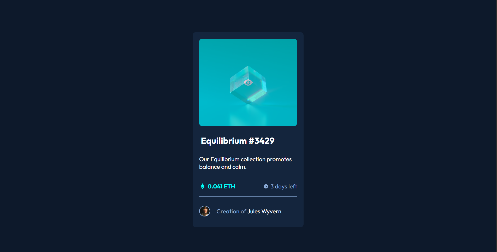
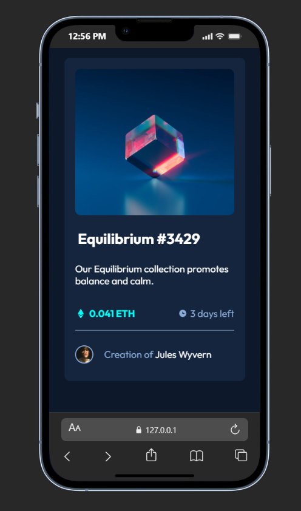

# NFT preview card component

This project is a responsive NFT preview card UI component built to demonstrate clean layout structure, hover interactions, and scalable styling using SCSS.

The focus of this project is visual polish, responsiveness, and maintainable styles rather than application logic. It showcases attention to detail in UI behavior and component-level styling.


## Overview

The NFT preview card displays key NFT information with interactive hover states and adapts smoothly across different screen sizes. It emphasizes visual hierarchy, spacing, and subtle user interactions commonly expected in modern web interfaces.


### Features

* Interactive hover states for images and text elements

* Clean visual hierarchy and spacing

* Mobile-first implementation


### Screenshot





### Live Demo and Source

- [Live Demo](https://nft-preview-card-beryl-theta.vercel.app/)

- [Source](https://www.frontendmentor.io/solutions/responsive-nft-card-preview-page-with-scss-flex-b0sMEJWq0L)


## Tech Stack

 - Semantic HTML5

 - SCSS (variables, nesting)

 - Flexbox

 - Mobile-first workflow


 ## Implementation Notes

  SCSS was used to improve maintainability by centralizing color values and reducing repetition through nesting. Hover states were designed to feel subtle but intentional, enhancing the user experience without overwhelming the UI.

Example hover overlay implementation:
```scss
.img-container:hover {
  background: url(./images/icon-view.svg);
  background-color: hsla(178, 100%, 50%, 1);
  background-size: 10%;
  background-repeat: no-repeat;
  background-position: center;
  cursor: pointer;
}
```
This approach creates a clean overlay effect that visually communicates interactivity while preserving the underlying layout.

### What I Learned

- Structuring reusable and readable SCSS using variables

- Creating overlay hover effects with background images and opacity

- Aligning and spacing UI elements using Flexbox

- Building responsive layouts with a mobile-first mindset

## Future Improvements
- Improve component reusability

- Introduce CSS Grid for more complex layouts

- Further refine responsive behavior

- Improve project structure for scalability

## Author
 Awosanya Ifeoluwa Victor (Viipzy)

- Github - [Viipzy](https://github.com/viipzy)

- Linkedin - [@awosanyaVictor](https://www.linkedin.com/in/awosanya-ifeoluwavictor/)
